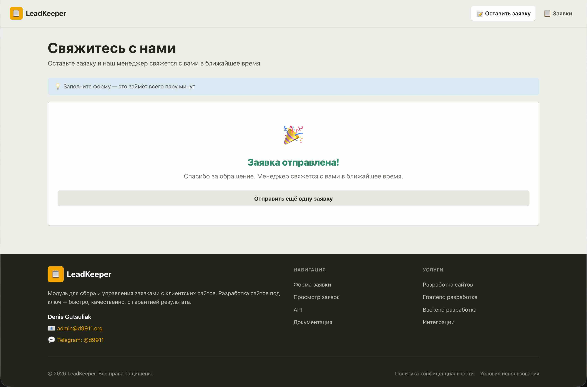
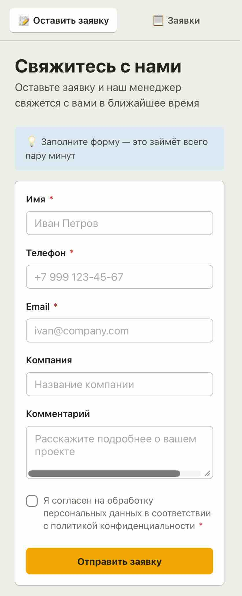
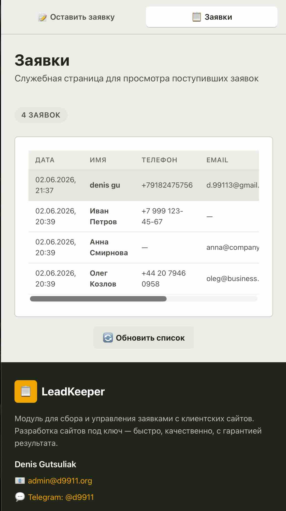

# LeadKeeper — Lead Capture Module

> Мини-прототип модуля сбора заявок (lead-capture) для Alakris Platform.
> Форма с валидацией, локальное хранение, админ-просмотр заявок.

---

  <div style="flex: 2; text-align: center;">
    
    <p><strong>Desktop</strong></p>
  </div>
<div style="display: flex; flex-direction: row; justify-content: space-between; align-items: flex-start; gap: 20px; width: 100%; margin: 24px 0;">
  <div style="flex: 1; text-align: center;">
    
    <p><strong>Mobile</strong></p>
  </div>
  <div style="flex: 1; text-align: center;">
    
    <p><strong>List</strong></p>
  </div>
</div>

**Дизайн**: PostHog-inspired — тёплый кремовый фон, минималистичный стиль, жёлто-оранжевый акцент.

---

## Возможности

- 📝 **Форма заявки** с отдельными полями: имя, телефон, email, компания, комментарий, согласие
- ✅ **Строгая валидация** на клиенте и сервере:
  - Телефон: `+КодСтраны Номер` (максимум 16 цифр)
  - Email: RFC 5322 compliant (латинские буквы, цифры, точки, дефис)
  - Хотя бы один контакт (телефон или email) обязателен
- 💾 **Сохранение заявок** в SQLite
- 📧 **Email-уведомления** владельцу при новой заявке (SMTP)
- 📬 **Подтверждение пользователю** на email
- 📋 **Служебная страница** `/admin` для просмотра заявок
- 📱 **Адаптивный дизайн** (PostHog-inspired)
- 📚 **Swagger UI** для тестирования API

---

## API Endpoints

### Swagger UI

Интерактивная документация API доступна по адресу:

```
http://localhost:8000/docs
```

### Endpoints

| Method | Endpoint           | Описание                           | Параметры                 |
| ------ | ------------------ | ---------------------------------- | ------------------------- |
| `GET`  | `/api/health`      | Проверка работоспособности сервиса | —                         |
| `POST` | `/api/leads`       | Создать новую заявку               | [LeadCreate](#leadcreate) |
| `GET`  | `/api/leads`       | Получить список всех заявок        | —                         |
| `GET`  | `/api/leads/{id}`  | Получить заявку по ID              | `id` (int)                |
| `GET`  | `/api/leads/count` | Получить количество заявок         | —                         |

---

### GET /api/health

Проверка здоровья сервиса.

**Response:**

```json
{
  "status": "ok",
  "service": "leadkeeper"
}
```

**Example:**

```bash
curl http://localhost:8000/api/health
```

---

### POST /api/leads

Создать новую заявку.

**Request Body (`LeadCreate`):**

| Поле      | Тип     | Обязательно | Описание                                           |
| --------- | ------- | ----------- | -------------------------------------------------- |
| `name`    | string  | ✅          | Имя клиента (2-100 символов)                       |
| `phone`   | string  | ⚠️          | Телефон (формат: `+КодСтраны Номер`, макс 16 цифр) |
| `email`   | string  | ⚠️          | Email (RFC 5322)                                   |
| `company` | string  | ❌          | Название компании                                  |
| `comment` | string  | ❌          | Комментарий                                        |
| `consent` | boolean | ✅          | Согласие на обработку данных                       |

> ⚠️ Хотя бы одно из полей `phone` или `email` должно быть заполнено.

**Validation Rules:**

| Поле      | Правила                                                                                                            |
| --------- | ------------------------------------------------------------------------------------------------------------------ |
| `name`    | 2-100 символов, не пустой                                                                                          |
| `phone`   | `+КодСтраны Номер` (пример: `+7 999 123-45-67`), макс 16 цифр, минимум 7 цифр                                      |
| `email`   | RFC 5322: латинские буквы, цифры, `.` `-` `_` `!` `#` `$` `%` `&` `'` `*` `+` `/` `=` `?` `` ` `` `{` `\|` `}` `~` |
| `consent` | Должен быть `true`                                                                                                 |

**Success Response (200):**

```json
{
  "id": 1,
  "name": "Иван Петров",
  "phone": "+7 999 123-45-67",
  "email": null,
  "company": "ТехноСофт",
  "comment": "Хочу интеграцию",
  "consent": true,
  "created_at": "2026-06-02T20:39:48"
}
```

**Error Response (400):**

```json
{
  "detail": "At least one contact method (phone or email) is required"
}
```

**Examples:**

```bash
# Создать заявку с телефоном
curl -X POST http://localhost:8000/api/leads \
  -H "Content-Type: application/json" \
  -d '{"name":"Иван Петров","phone":"+7 999 123-45-67","company":"ТехноСофт","consent":true}'

# Создать заявку с email
curl -X POST http://localhost:8000/api/leads \
  -H "Content-Type: application/json" \
  -d '{"name":"Анна Смирнова","email":"anna@company.ru","comment":"Хочу интеграцию","consent":true}'

# Создать заявку с обоими контактами
curl -X POST http://localhost:8000/api/leads \
  -H "Content-Type: application/json" \
  -d '{"name":"Олег Козлов","phone":"+44 20 7946 0958","email":"oleg@business.co.uk","company":"BizGroup","comment":"Test","consent":true}'
```

---

### GET /api/leads

Получить список всех заявок (новые первые).

**Response (200):**

```json
[
  {
    "id": 3,
    "name": "Олег Козлов",
    "phone": "+44 20 7946 0958",
    "email": "oleg@business.co.uk",
    "company": "BizGroup",
    "comment": "Test comment",
    "consent": true,
    "created_at": "2026-06-02T20:39:48"
  },
  {
    "id": 2,
    "name": "Анна Смирнова",
    "phone": null,
    "email": "anna@company.ru",
    "company": null,
    "comment": "Хочу интеграцию",
    "consent": true,
    "created_at": "2026-06-02T20:39:48"
  }
]
```

**Example:**

```bash
curl http://localhost:8000/api/leads
```

---

### GET /api/leads/count

Получить количество заявок.

**Response (200):**

```json
{
  "count": 3
}
```

**Example:**

```bash
curl http://localhost:8000/api/leads/count
```

---

### GET /api/leads/{id}

Получить одну заявку по ID.

**Parameters:**
| Параметр | Тип | Описание |
|----------|-----|----------|
| `id` | integer | ID заявки |

**Response (200):**

```json
{
  "id": 1,
  "name": "Иван Петров",
  "phone": "+7 999 123-45-67",
  "email": null,
  "company": "ТехноСофт",
  "comment": "Хочу интеграцию",
  "consent": true,
  "created_at": "2026-06-02T20:39:48"
}
```

**Response (404):**

```json
{
  "detail": "Lead not found"
}
```

**Example:**

```bash
curl http://localhost:8000/api/leads/1
```

---

## Схема данных

### LeadCreate

```typescript
interface LeadCreate {
  name: string // required, 2-100 chars
  phone?: string // optional, +CC NNN format
  email?: string // optional, valid email format
  company?: string // optional
  comment?: string // optional
  consent: boolean // required, must be true
}
```

### LeadResponse

```typescript
interface LeadResponse {
  id: number
  name: string
  phone: string | null
  email: string | null
  company: string | null
  comment: string | null
  consent: boolean
  created_at: string // ISO 8601 datetime
}
```

---

## Дизайн-система

| Элемент        | Значение                            |
| -------------- | ----------------------------------- |
| Фон            | `#eeefe9` — тёплый кремовый         |
| Карточки       | `#ffffff` — белый с тонкой границей |
| Акцент         | `#f7a501` — жёлто-оранжевый (CTA)   |
| Текст          | `#23251d` — глубокий олив-чаркоал   |
| Радиусы        | 4–8px для карточек и кнопок         |
| Без градиентов | Чистый минималистичный стиль        |

## Стек

- **Frontend**: React 18 + TypeScript + Vite + React Router
- **Backend**: Python + FastAPI + SQLAlchemy
- **База данных**: SQLite
- **Email**: SMTP (python-dotenv для настроек)
- **API Docs**: Swagger UI (`/docs`), ReDoc (`/redoc`)

## Быстрый старт

### Linux / macOS

```bash
cd leadkeeper
make install   # Установить зависимости
make dev       # Запустить frontend + backend
```

### Windows

```cmd
cd leadkeeper
make.bat install   # Установить зависимости
make.bat dev       # Запустить frontend + backend
```

Или напрямую:

```cmd
# Backend
cd backend
pip install -r requirements.txt
uvicorn app.main:app --reload --port 8000

# Frontend (в отдельном терминале)
cd frontend
npm install
npm run dev
```

### Откройте в браузере

| Сервис              | URL                              |
| ------------------- | -------------------------------- |
| **Форма заявки**    | http://localhost:5173            |
| **Просмотр заявок** | http://localhost:5173/admin      |
| **API Health**      | http://localhost:8000/api/health |
| **Swagger UI**      | http://localhost:8000/docs       |
| **ReDoc**           | http://localhost:8000/redoc      |

---

## Email-уведомления

Для включения email-уведомлений создайте файл `.env` в папке `backend/`:

```bash
cp backend/.env.example backend/.env
```

Отредактируйте `.env`:

```env
# Email владельца (куда приходят уведомления о новых заявках)
OWNER_EMAIL=your@email.com

# SMTP сервер 1 (основной)
SMTP_HOST=smtp.mail.ru
SMTP_USER=your@email.com
SMTP_PASS=APP_PASSWORD  # Пароль приложения, не обычный пароль!
SMTP_PORT=465
SMTP_SECURE=true

# SMTP сервер 2 (резервный)
SMTP_HOST_2=sandbox.smtp.mailtrap.io
SMTP_USER_2=user
SMTP_PASS_2=password
SMTP_PORT_2=2525
SMTP_SECURE_2=false

# Метод отправки: 0=выкл, 1=основной, 2=резервный
SMTP_METHOD=1
```

### Важно: Пароль приложения

**Mail.ru** требует специальный "пароль приложения", а не обычный пароль от почты:

1. Зайдите в настройки почты: https://mail.ru/settings/
2. Перейдите в **Пароли для внешних приложений**
3. Создайте новый пароль для приложения (например, "LeadKeeper")
4. Скопируйте этот пароль в `SMTP_PASS`

Для **Gmail**:

1. https://myaccount.google.com/security
2. "Пароли приложений" (нужно включить 2FA)
3. Создайте пароль для "Другое"

При новой заявке:

1. **Владельцу** отправляется уведомление с данными заявки (красивый HTML-шаблон)
2. **Пользователю** отправляется подтверждение (если указан email)

---

## Валидация

### Телефон

- Формат: `+КодСтраны Номер`
- Примеры: `+7 999 123-45-67`, `+44 20 7946 0958`
- Максимум 16 цифр после `+`
- Минимум 7 цифр после `+`

### Email

- RFC 5322 compliant
- Латинские буквы, цифры, `.` `-` `_` `!` `#` `$` `%` `&` `'` `*` `+` `/` `=` `?` `` ` `` `{` `|` `}` `~`
- Нельзя: пробелы, кириллица, `< > ( ) [ ] \ , "`
- Нельзя начинать/заканчиваться точкой
- Нельзя две точки подряд

### Обязательные поля

- Имя (2-100 символов)
- Телефон **или** email (хотя бы один)
- Согласие на обработку данных

---

## Чек-лист проверки

- [ ] `make install` успешно устанавливает зависимости
- [ ] `make dev` запускает приложение без ошибок
- [ ] Форма открывается и отображается корректно
- [ ] Валидация работает: пустая форма показывает ошибки
- [ ] Валидация телефона: слишком длинный номер отклоняется
- [ ] Валидация email: неправильный формат отклоняется
- [ ] После заполнения формы и отправки показывается сообщение об успехе
- [ ] Заявка появляется на странице `/admin`
- [ ] Таблица заявок отображает все поля корректно
- [ ] Swagger UI доступен по адресу `/docs`

### Ручная проверка API

```bash
# Health check
curl http://localhost:8000/api/health

# Создать заявку
curl -X POST http://localhost:8000/api/leads \
  -H "Content-Type: application/json" \
  -d '{
    "name": "Иван Петров",
    "phone": "+7 999 123-45-67",
    "company": "ТехноСофт",
    "comment": "Хотим интегрировать форму",
    "consent": true
  }'

# Получить все заявки
curl http://localhost:8000/api/leads

# Получить количество заявок
curl http://localhost:8000/api/leads/count
```

---

## Структура проекта

```
leadkeeper/
├── backend/
│   ├── app/
│   │   ├── main.py          # FastAPI app, endpoints
│   │   ├── database.py      # SQLite config
│   │   ├── models.py        # SQLAlchemy Lead model
│   │   ├── schemas.py       # Pydantic schemas + validation
│   │   ├── crud.py          # CRUD operations
│   │   └── email_service.py # SMTP email notifications
│   ├── .env.example         # Email config template
│   ├── requirements.txt
│   └── leadkeeper.db        # SQLite database
├── frontend/
│   ├── src/
│   │   ├── api/leads.ts     # API client
│   │   ├── components/
│   │   │   ├── LeadForm.tsx # Form with validation
│   │   │   └── LeadsTable.tsx
│   │   ├── pages/
│   │   │   ├── LeadPage.tsx
│   │   │   └── AdminPage.tsx
│   │   ├── App.tsx
│   │   ├── main.tsx
│   │   └── index.css        # PostHog-inspired design
│   ├── index.html
│   └── package.json
├── Makefile                 # Linux/macOS
├── make.bat                 # Windows
├── README.md
├── REPORT.md
└── screenshots/
```

---

## Допущения

1. **Хранение**: SQLite для простоты. Для production — PostgreSQL.
2. **Без авторизации**: `/admin` открыт без авторизации (указано в requirements).
3. **Email опционально**: Если SMTP не настроен, заявки сохраняются без отправки писем.
4. **Без защиты от спама**: В production добавить rate limiting или captcha.

## Production-риски

1. **Безопасность**: `/admin` → защитить авторизацией (JWT) или закрыть VPN/паролем
2. **Спам**: Добавить rate limiting + CAPTCHA
3. **Масштабирование**: SQLite → PostgreSQL
4. **Миграции**: Добавить Alembic
5. **Email**: Использовать SendGrid / Amazon SES для надёжности
6. **Юридическое**: Согласие на обработку данных (152-ФЗ, GDPR)

---

**Время выполнения**: ~4 часа

## License

MIT License. See [LICENSE](LICENSE) for details.
